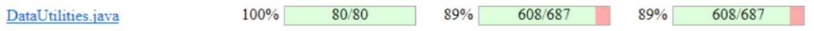

**SENG 438 - Software Testing, Reliability, and Quality**

**Lab. Report \#4 – Mutation Testing and Web app testing**

| Group \#:      |     |
| -------------- | --- |
| Student Names: |     |
|                |     |
|                |     |
|                |     |

# Introduction

# Analysis of 10 Mutants of the Range class 

# Report all the statistics and the mutation score for each test class
DataUtilities:

Original:

Updated:

Originally when we ran the PIT mutation tests, we had a line coverage of 100%, a mutation coverage of 89% and a test strength of 89% as well. After updating the tests we were able get an increase of 4% for our mutation coverage. So after updating the tests we got a line coverage of 100%, a mutation coverage of 93% and a test strength of 93% as well.
# Analysis drawn on the effectiveness of each of the test classes

# A discussion on the effect of equivalent mutants on mutation score accuracy

# A discussion of what could have been done to improve the mutation score of the test suites

# Why do we need mutation testing? Advantages and disadvantages of mutation testing

# Explain your SELENUIM test case design process

# Explain the use of assertions and checkpoints

# how did you test each functionaity with different test data

# Discuss advantages and disadvantages of Selenium vs. Sikulix

# How the team work/effort was divided and managed

# Difficulties encountered, challenges overcome, and lessons learned

# Comments/feedback on the lab itself
